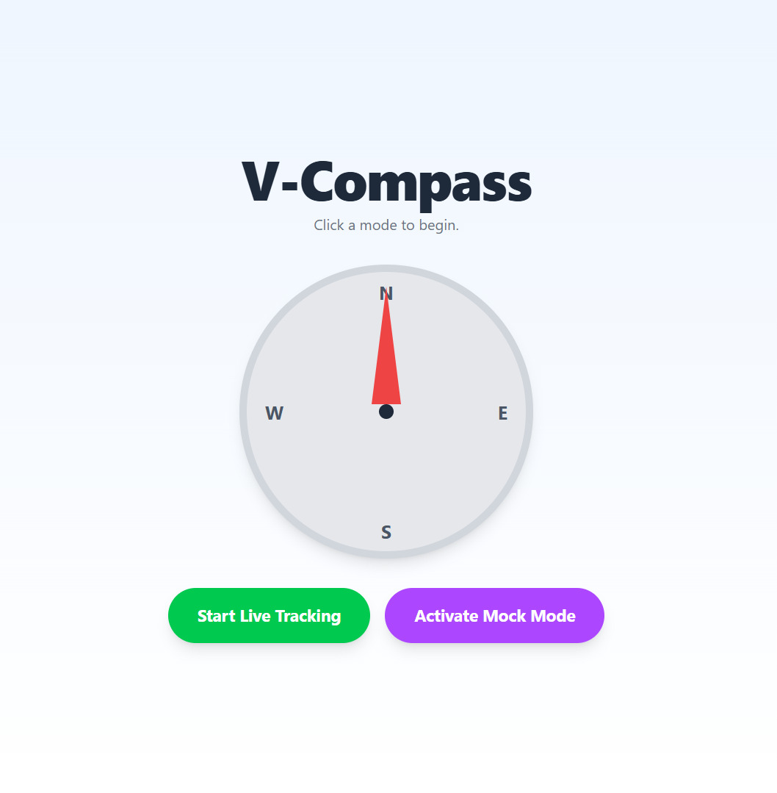
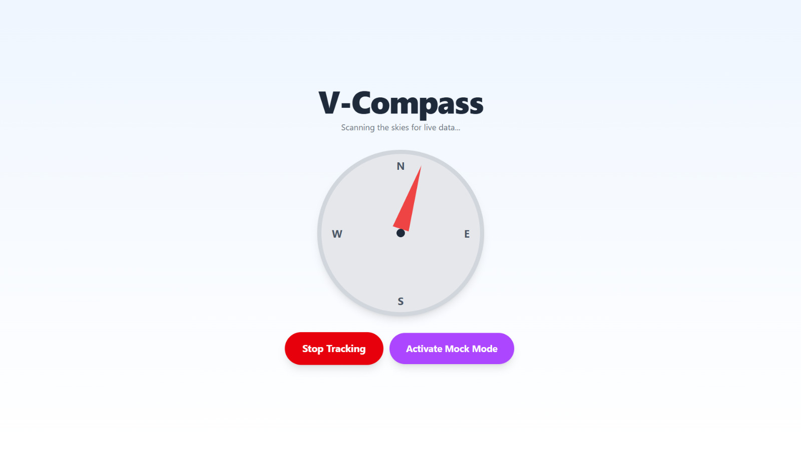
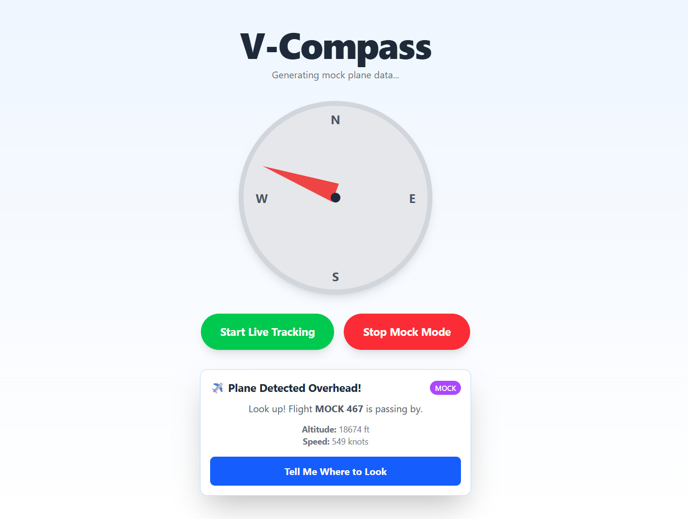
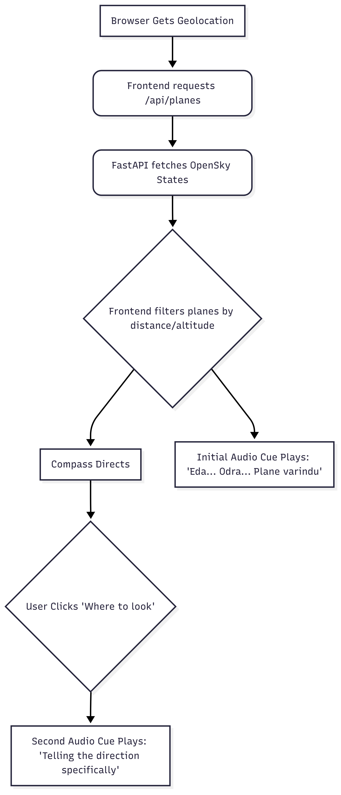

# V-Compass ( Vimaanam Compass )

## Basic Details
### Team Name: Darbi

### Team Members
- Team Lead: Binil Babu P - [Vidya Academy of Science and Technology]
- Member 2:  Darwin T D- [Vidya Academy of Science and Technology]

### Project Description
V-Compass is your personal sky-watcher, a web application designed to bring back the simple joy of plane spotting. It uses live flight data and your location to find aircraft passing overhead, helping you reconnect with a forgotten sense of wonder.

### The Problem (that doesn't exist)
In our busy modern lives, we often forget to look up. We don't have the time to constantly watch the skies, and even when we do, we can easily miss the silent planes gliding far above. This means we're missing out on a simple, freely available happiness—a small moment of wonder in an otherwise hectic day.

### The Solution (that nobody asked for)
V-Compass actively watches the skies for you. It solves the problem by:

Notifying You: It sends an alert when a plane is nearby, so you don't have to remember to look.

Guiding You: A simple on-screen compass points you in the exact direction, removing the guesswork.

Speaking to You: A single tap can provide a verbal cue, like "Look North," making it effortless to find the aircraft.

By doing the work of finding the plane, V-Compass lets you simply enjoy the moment of spotting it, ensuring you never miss your happiness again.

## Technical Details
### Technologies/Components Used
For Software:
- Languages used
  - Python (FastAPI backend)
  - JavaScript (React frontend)
- Frameworks used
  - FastAPI (backend REST API)
  - React (frontend UI)
  - Tailwind CSS (utility-first styling via classNames)
- Libraries used
  - requests (HTTP client for Python)
  - fastapi, starlette, CORSMiddleware (web framework and CORS)
  - Browser Geolocation API, Notifications API (frontend)
- Tools used
  - Node.js + npm (frontend dev server/build)
  - uvicorn (run FastAPI)
  - Vite or CRA (frontend tooling)

For Hardware:
- None

### Implementation
For Software:

# Installation
Backend (FastAPI):
- Create and activate a virtual environment
  - python -m venv .venv
  - source .venv/bin/activate  (Windows: .venv\Scripts\activate)
- Install dependencies
  - pip install fastapi uvicorn requests
- Save the backend file as main.py with the provided code.

Frontend (React with Vite):
- Create a React project
  - npm create vite@latest v-compass-frontend -- --template react
  - cd v-compass-frontend
  - npm install
- Optional: Add Tailwind CSS (to match provided classes)
  - npm install -D tailwindcss postcss autoprefixer
  - npx tailwindcss init -p
  - Configure tailwind.config.js content paths to src/**/* and include Tailwind directives in src/index.css
- Replace src/App.jsx with the provided app.jsx code.

# Run
Backend:
- uvicorn main:app --reload --host 0.0.0.0 --port 8000

Frontend:
- npm run dev  (Vite defaults to http://localhost:5173)

CORS:
- Backend allows http://localhost, http://localhost:3000, http://localhost:5173
- Ensure the frontend runs on one of these origins.

### Project Documentation
For Software:

# Screenshots (Add at least 3)

### Initial Webpage

### Started Tracking

### Plane Detected

# Diagrams
Workflow

## Team Contributions
- Binil Babu P: Backend FastAPI endpoint design,React frontend UI/UX, compass visualization, geolocation/notifications
- Darwin T D: OpenSky integration, API error handling, CORS configuration, Github repo.
